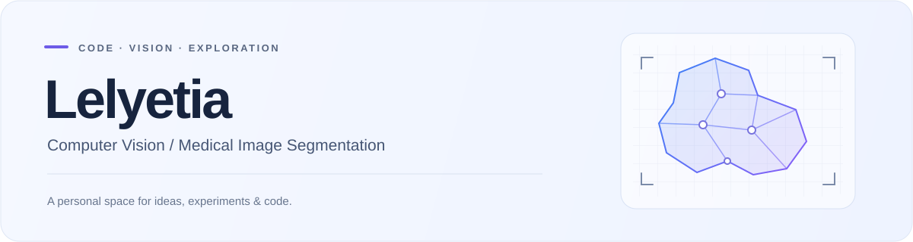

<picture>
  <source media="(prefers-color-scheme: dark)" srcset="./assets/header-dark.svg">
  <source media="(prefers-color-scheme: light)" srcset="./assets/header-light.svg">
  
</picture>

 

**[GitHub](https://github.com/Lelyetia) · [Stars](https://github.com/Lelyetia?tab=stars) · [Email](mailto:zhoulyd@126.com)**

 

你好，我是 **Lelyetia**。关注**计算机视觉、医学图像分割与深度学习**，喜欢探索图像中的结构与语义，以及算法在医学图像中的应用。

希望在这里把想法变成代码，把探索整理成可以分享的项目与笔记。

## 技术兴趣 / Focus

| Computer Vision | Medical Imaging | Deep Learning |
| :--- | :--- | :--- |
| 图像理解与视觉表示 | 生物医学图像分割 | 视觉任务中的深度学习方法 |

## 联系交流 / Connect

欢迎交流**图像分割、计算机视觉与开源实践**。

**Email** · [zhoulyd@126.com](mailto:zhoulyd@126.com) · [zhouluoyidi@gmail.com](mailto:zhouluoyidi@gmail.com)

 

---

  Ideas → Experiments → Code

